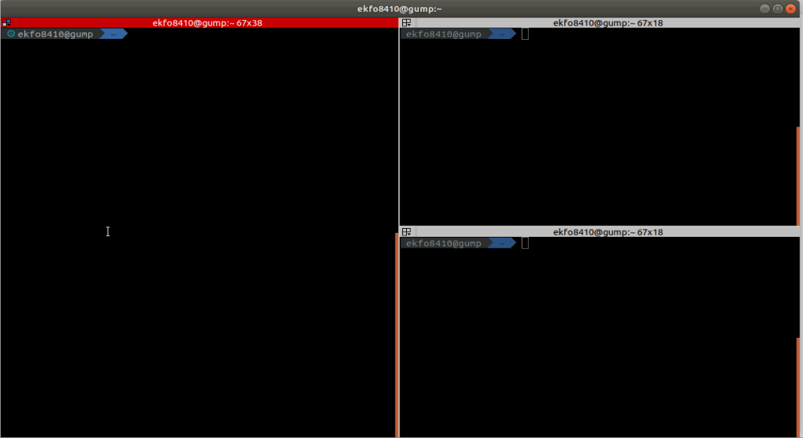
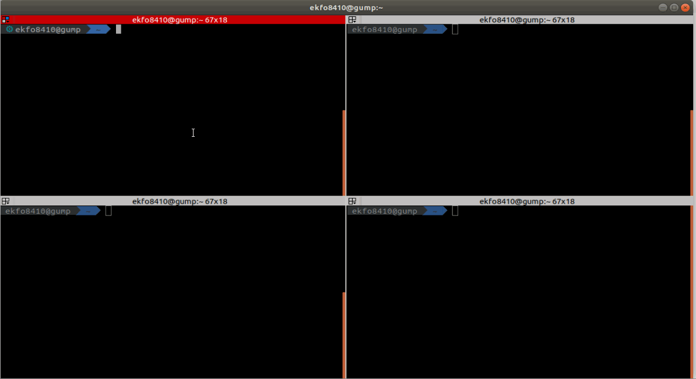
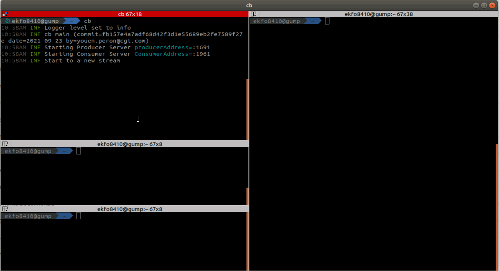

# Cat Balancer

Cat Balancer is line based load balancer for net cat `nc`.

## Usage

```
cb [-p <producers-port>] [-c <consumers-port>]
```

###  One Producer to One Consumer



###  One Producer to Many Consumers



###  Many Producers to One Consumer



###  Many Producers to Many Consumers

