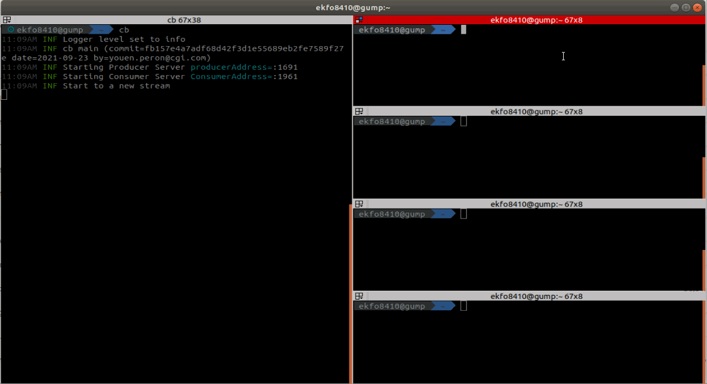

# Cat Balancer

Cat Balancer is line based load balancer for net cat `nc`.

## Features

- Many producers
- Many consumers
- Close consumers socket on last producer close event
- Individual rate metrics in line / second for all peers
- Back Pressure detection for each producer
- Start a new session after drain consumers

## Usage

```
cb [-p <producers-port>] [-c <consumers-port>] [-i <interval>]
```

###  One Producer to One Consumer


###  One Producer to Many Consumers


###  Many Producers to One Consumer


###  Many Producers to Many Consumers


